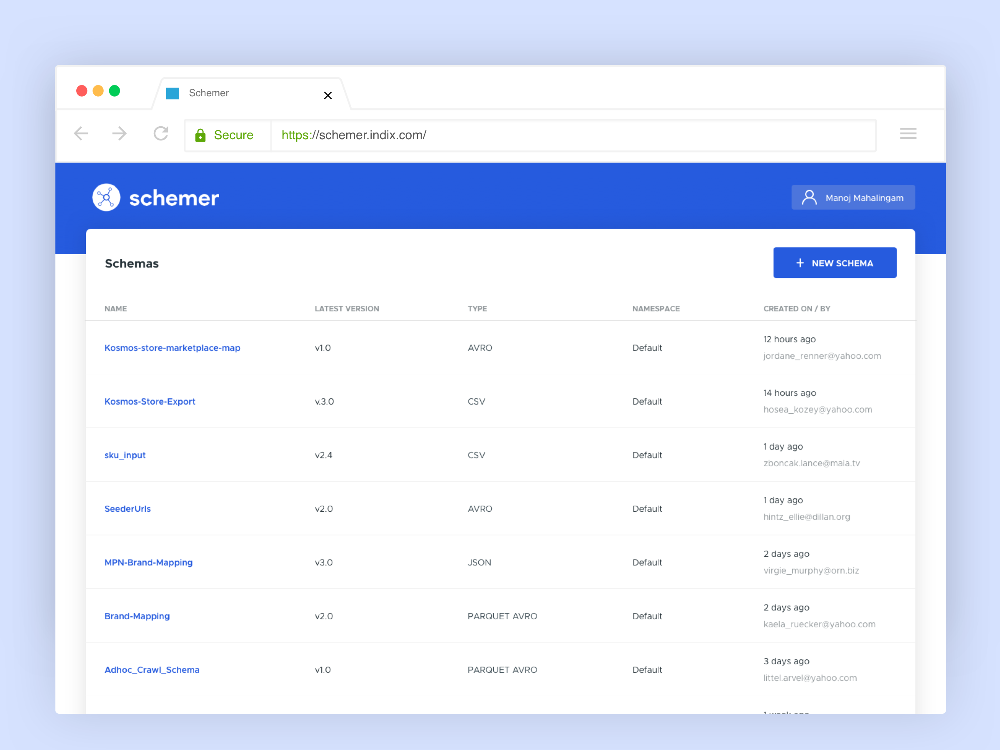
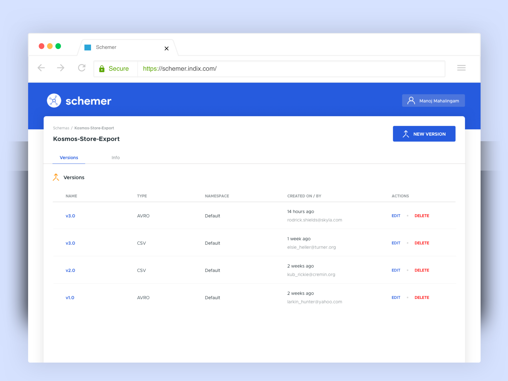
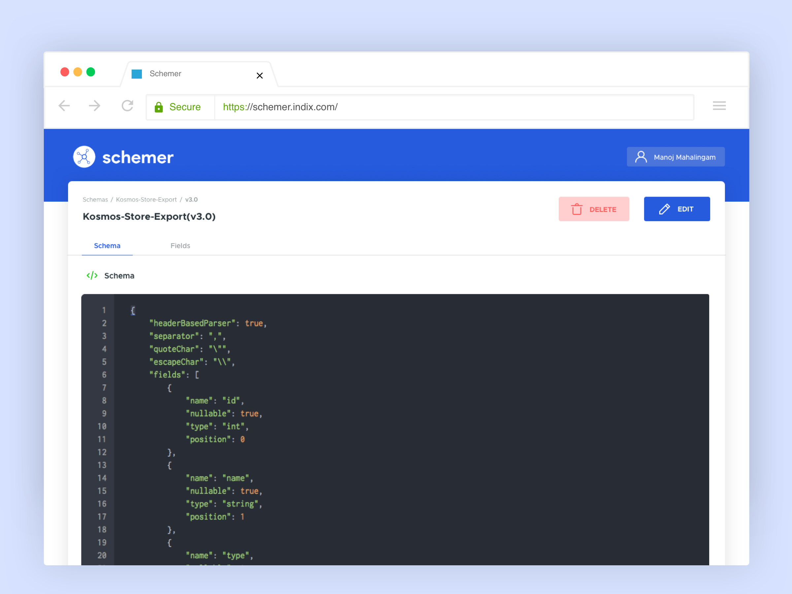
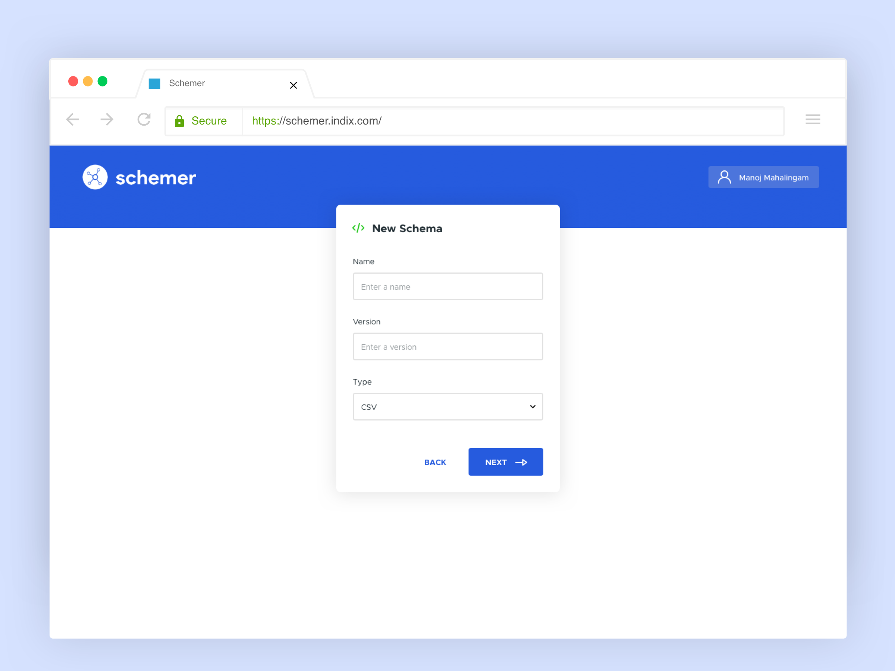
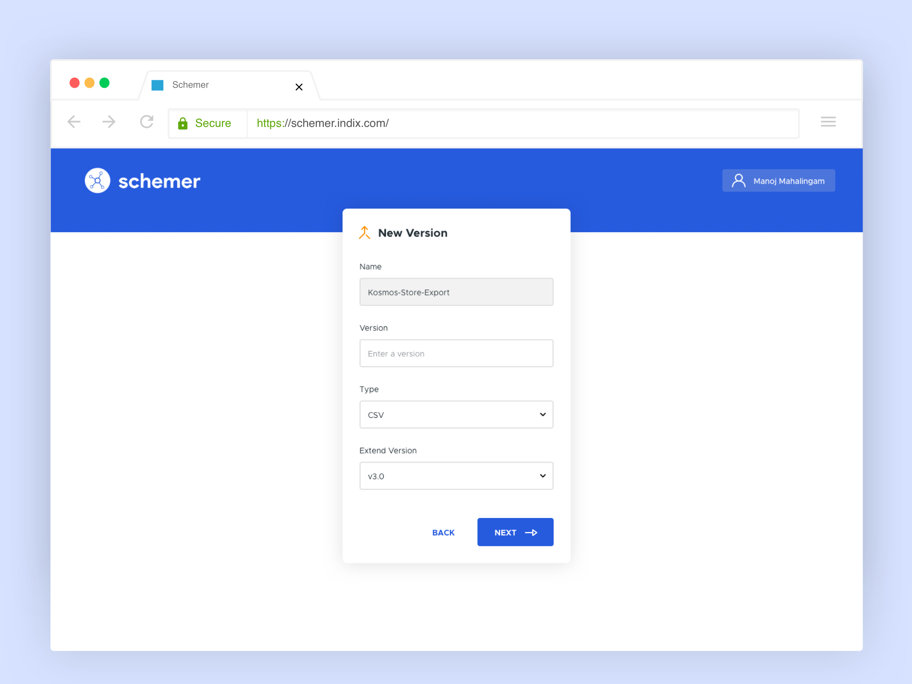
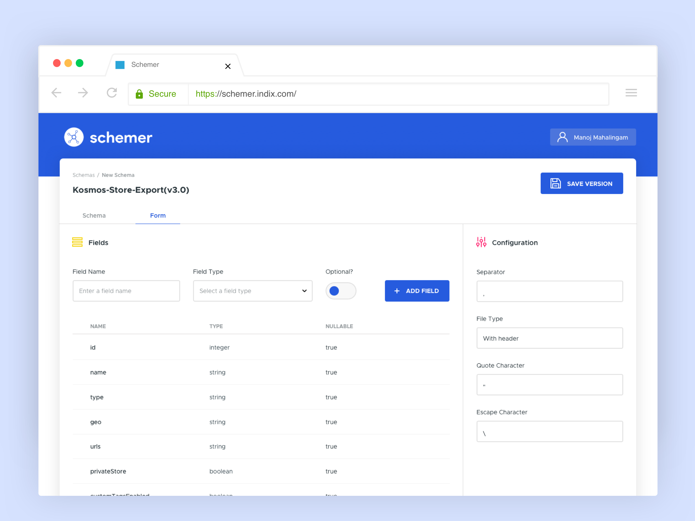

# Schemer UI screens

## Browse schemas

    

## Schema Details

    

## JSON representaion of Schema

    

## Create Schema

    

## Create Schema Version

    

## Field definition Wizard

    

